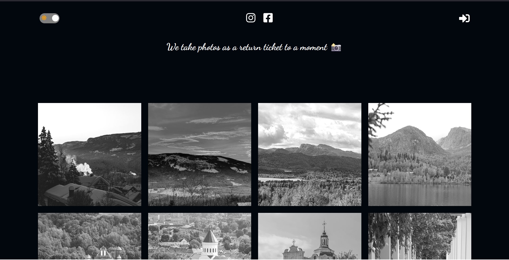

# Online Photo Gallery Project

This project is a beautiful and interactive way to showcase and explore a collection of photos online. Utilizing Firebase as the backend server, React for the frontend, Framer Motion for smooth animations, this project aims to provide an immersive visual experience.

## [PhotoGallery]([https://github.com/iamshaunjp/firegram/tree/starter-files](https://www.myphotogallery.fun/)).

## Texhnologies Used

Backend:
- Firebase

Frontend:
- React
- Framer Motion

## Project Overview

### Firebase as the backend server

Firebase serves as the backend server, offering a reliable and scalable solution for storing and retrieving data related to the photo gallery. Firebase's real-time database capabilities ensure your gallery stays updated with the latest additions.

### Frontend with React

The frontend is developed using React, providing a responsive and dynamic user interface. It's mobile-friendly.

### Animation with Framer Motion

Framer Motion is integrated into the project to add smooth and eye-catching animations to various page elements. This enhances the visual appeal of the gallery, making the browsing experience more engaging and enjoyable.
